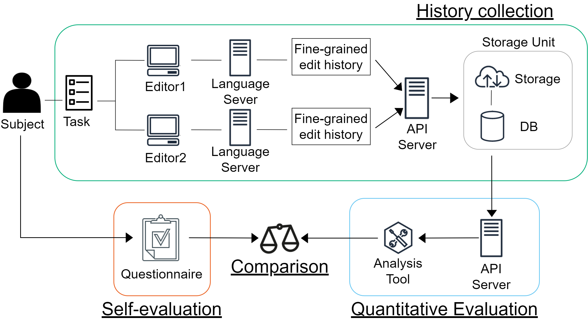

# sairi-common

This repository is a utility library for the fine-grained edit history collection platform.

## Fine-grained edit history collection platform

### Overview

This platform enables users to collect fine-grained edit history from various code editors through the language-server protocol.



### Modules

#### [inoueke-n/sairi-common](https://github.com/inoueke-n/sairi-common)

A utility library.

#### [inoueke-n/sairi-plugin-for-vscode](https://github.com/inoueke-n/sairi-plugin-for-vscode)

Basic implementation of a fine-grained edit history collector.
This repository contains following three modules.

* LSP-extended
  * An extended protocol which defines requests for collecting edit history.
* server
  * A language server module.
* sairi-collector
  * VS Code plugin to collect a fine-grained edit history via the language server above.

#### [inoueke-n/sairi-plugin-for-eclipse](https://github.com/inoueke-n/sairi-plugin-for-eclipse)

An Eclipse plugin of a fine-grained edit history collector. Depends on the language server above.

#### [inoueke-n/sairi-backend](https://github.com/inoueke-n/sairi-backend)

A server module to store and load collected edit history.

### Related articles

* Sentaro Onizuka, Tetsuya Kanda, Katsuro Inoue: "Comparison of Developer's Work Efficiency Between Different Editors", Proceedings of the 29th Asia-Pacific Software Engineering Conference (APSEC2022) Poster session, pp.572-573, Dec. 2022
* (Japanese article) 石田 直人, 神田 哲也, 嶋利 一真, 井上 克郎: "言語サーバを応用した細粒度編集履歴収集プラットフォームの構想", ソフトウェアエンジニアリングシンポジウム2020 ワークショップ (SES 2020 WS5), 2020年9月

## Usage

```sh
npm i @inoueke-n/sairi-common@0.6.0
```

## Build

```sh
npm install
npm run build
```
